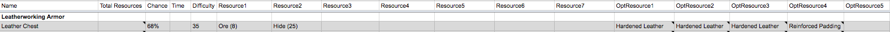

This JSON file was generated with a ruby script by parsing a slightly modified version of CytheS' Google Sheet. 

The ruby script is currently particular about column layout. The following must be used:

